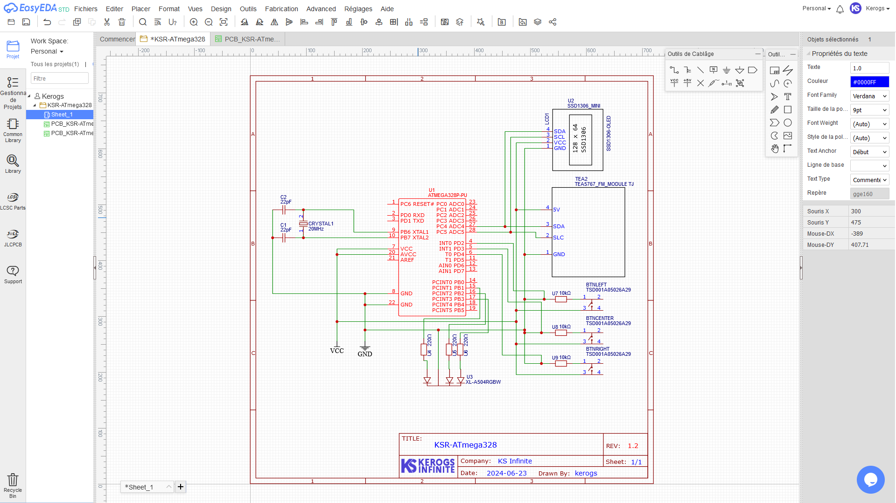
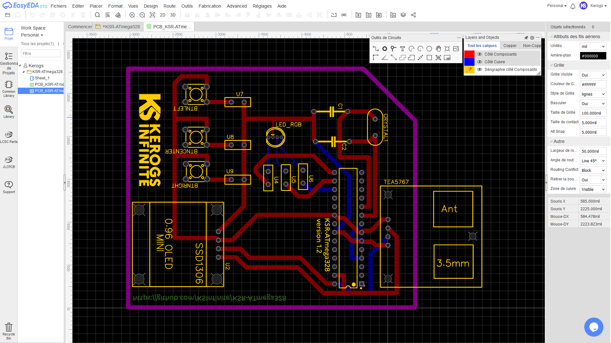
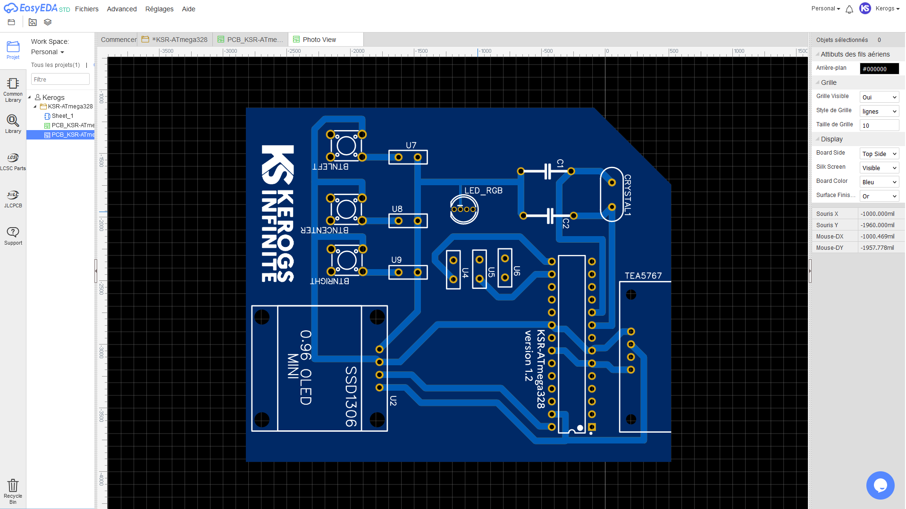
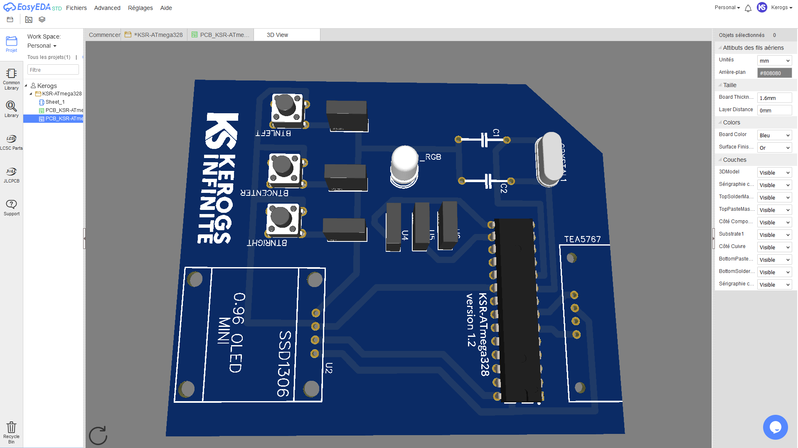

# KSR-ATmega328

Radio with an ATmega328

> [!IMPORTANT]
> The project is still in progress
>
> - PCB layout is subject to improvement and/or change.
> - The code is subject to improvement and/or change.
> - The use of new parts or component changes is possible.

## List of electronic components

- MCU - **_ATmega328_**
- Screen - **_IIC OLED SSD1306_**
- Regulator - **_LM1117-3.3_**
- FM receiver - **_TEA5767_** (module)
- potentiometer - **_b103_** (or similar)
- 5V power supply
- Speaker

## Libraries

- SPI
- [KS_TEA5767](https://github.com/kerogs/KS_TEA5767)
- Wire
- Adafruit SSD1306
- Adafruit GFX

## Preview

